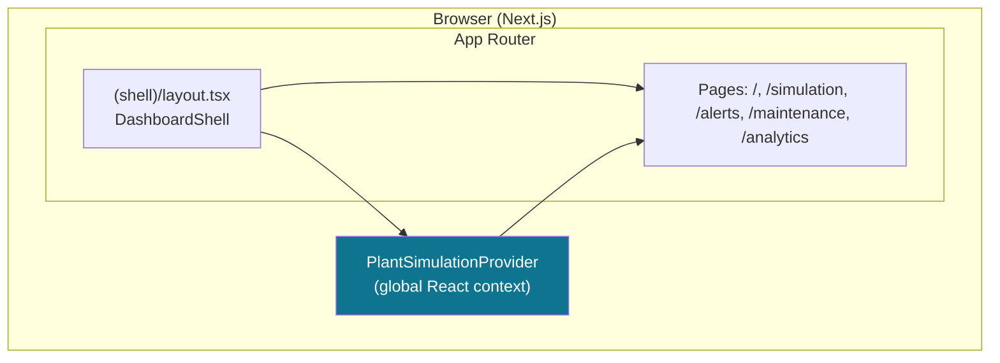
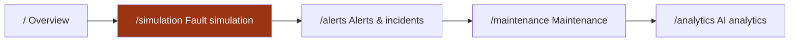
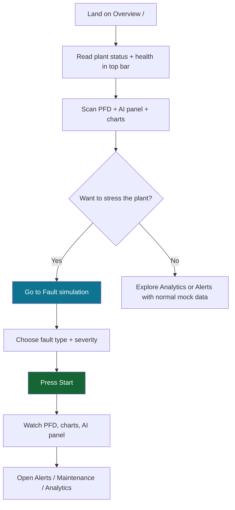
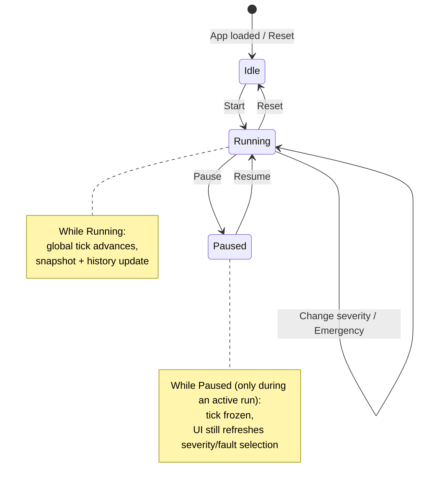
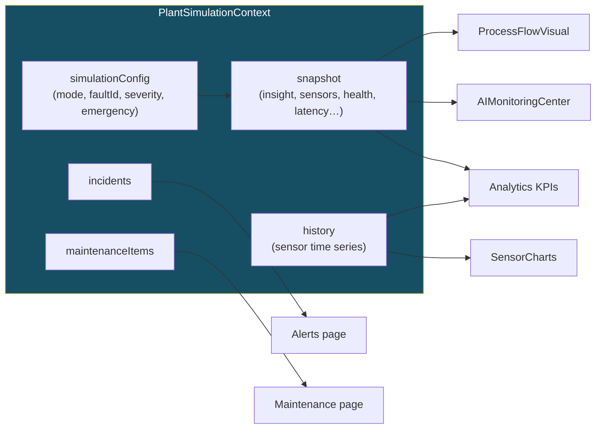

# Smart Factory Dashboard — Navigation & Flow Guide

This document helps **new teammates** understand what the dashboard is for, how the pieces connect, and **how to move through the UI** with confidence. The Tennessee Eastman Process (TEP) ML pipeline and notebooks live elsewhere in the repo; this app is a **self-contained Next.js operator UI** with an in-browser mock twin.

---

## 1. What you are looking at

The dashboard is a **multi-page, Industry 4.0–style command center** for a *digital twin* of a chemical plant. It is built with **Next.js (App Router)**, **React**, **Tailwind CSS**, and **Framer Motion**. Sensor streams, AI copy, and most charts are **simulated in the browser** so you can run `npm run dev` with **no backend**. To show real model metrics later, add your own wiring (for example static JSON under `public/data/` or a fetch to a service you control).

---

## 2. How to run it (30-second start)

From the **`dashboard/`** folder:

```bash
npm install
npm run dev
```

Open **http://localhost:3000** in a browser.

---

## 3. Big-picture architecture

The following diagram shows **what runs where** and how the shell wraps every page.



**Takeaway:** Almost everything you see on every page reads from **one shared state object** (`PlantSimulationProvider`). That is why starting a simulation on **Fault simulation** immediately changes plant status, charts, and incidents on other pages when you navigate there.

---

## 4. Site map — where to click

Think of the left sidebar (desktop) or the **horizontal strip** (mobile) as the **primary navigation**.



| Route | Primary audience | What you do here |
|-------|------------------|------------------|
| **`/`** | Everyone | **Situation picture:** process diagram (PFD), AI summary, live charts, recent events. |
| **`/simulation`** | Engineers / demos | **Drive scenarios:** pick a fault, severity, Start / Pause / Reset, Emergency. This is the main **interactive control room**. |
| **`/alerts`** | Operators / reliability | **Read and filter** incidents: severity, subsystem, search; expand cards for diagnosis and recommended action. |
| **`/maintenance`** | Maintenance planners | **Work-order style** cards: equipment, risk, steps, progress bars — tied to the current scenario when simulation is on. |
| **`/analytics`** | Data / ML stakeholders | **Trends and explainability-style views:** confidence vs anomaly, fault-class bars, SHAP-style feature ranking (mocked for the UI). |

The **top bar** is **global**: plant status, AI online, system health, time, notification badge, and a shortcut to **Control room** (`/simulation`).

---

## 5. First-time user journey (recommended order)

Use this path the first time you open the app so the mental model clicks.



1. **Overview** — Confirm “everything green” in mock normal operation.  
2. **Fault simulation** — Start a run; see pipes and reactor react, charts spike, AI text update.  
3. **Alerts** — See the **live scenario row** at the top when a run is active; practice filters.  
4. **Maintenance** — See how priorities and steps change with the scenario.  
5. **Analytics** — See confidence/anomaly trends and attribution charts fill in as time advances.

---

## 6. Fault simulation — controls explained

This page is the **scenario engine** for the whole UI (still mock-driven).



| Control | Effect |
|---------|--------|
| **Fault type** (dropdown) | Chooses which **signature** drives sensors, AI copy, PFD highlights, and incident text. Locked while a run is **active and not paused** (so you do not change physics mid-stream accidentally). |
| **Severity** (1–5) | Scales how “bad” the scenario looks: confidence, anomaly, health, time-to-failure window. |
| **Start** | Begins a **fault run** (`simulationRunning = true`), resets the scenario clock, clears chart history buffers for a clean replay. |
| **Pause / Resume** | **Only while a run is active:** freezes the **simulation tick** (time stops); charts stop appending new points until you resume. Normal operation (no active run) keeps the plant “alive” in the background. |
| **Reset** | Stops the run, clears emergency, resets severity baseline, returns to **normal** mock operation. |
| **+Severity** | Bumps severity by one step (cap at 5). |
| **Emergency** | Toggles an **escalation flag** — stronger critical styling, faster-looking degradation in the model text. |

---

## 7. How information flows inside the app (for developers)

This is the same mental model for **navigating** as for **extending** the dashboard.



**Navigation tip:** If something looks “wrong” after a demo, press **Reset** on **Fault simulation** or refresh the browser — the global clock and buffers live in memory.

---

## 8. File map (where to look in the repo)

| Area | Path (under `dashboard/`) |
|------|---------------------------|
| Routes + shell layout | `src/app/(shell)/` |
| Page transitions | `src/app/(shell)/template.tsx` |
| Sidebar + chrome | `src/components/layout/` |
| PFD, charts, glass panels | `src/components/dashboard/` |
| One file per main page | `src/components/pages/` |
| Global simulation state | `src/context/PlantSimulationContext.tsx` |
| Fault definitions | `src/lib/faultCatalog.ts` |
| Telemetry + AI mock math | `src/lib/mockTelemetry.ts` |
| Incident / maintenance data | `src/lib/incidents.ts`, `src/lib/maintenanceData.ts` |

---

## 9. FAQ

**Why do notifications show a number even on Overview?**  
The badge aggregates **unacknowledged high/critical-style items** in the incident list plus a small bonus when a simulation run is active — it is meant to feel like a real SOC, not a literal email count.

**Does the dashboard call the model on every chart update?**  
No. The **mock loop** runs in the browser. Adding HTTP calls to your own inference service or loading exported JSON would be a deliberate next step.

**Can I present this without Python?**  
Yes. `npm run dev` alone is enough for a full UI walkthrough.

---

## 10. One-page cheat sheet

1. **Sidebar** = main pages.  
2. **`/simulation`** = turn scenarios on/off.  
3. **Top bar** = always-on plant + AI + health + time + alerts.  
4. **Everything else** = read-only views fed by the same **global simulation state**.

Welcome aboard — open **Overview**, then **Fault simulation**, press **Start**, and follow the red/orange cues through **Alerts** and **Maintenance**.
