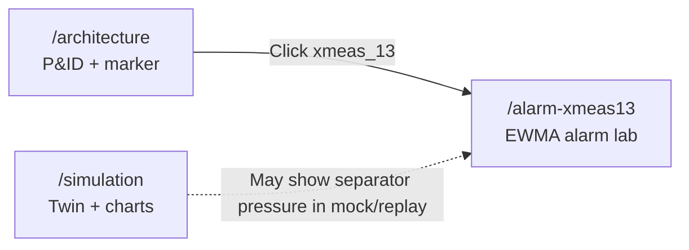

# Architecture — Dashboard Guide

**Route:** `/architecture`  
**Nav label:** Architecture  
**Source:** `dashboard/src/components/pages/ArchitecturePage.tsx`

---

## Purpose

This page gives operators and stakeholders a **visual anchor** for the Tennessee Eastman Process (TEP). It displays the plant **P&ID** (piping and instrumentation diagram) and highlights the instrument that powers the **Alarm lab**: separator pressure **`xmeas_13`**.

Use it in presentations to connect *physical plant layout* → *specific sensor* → *alarm engineering notebook*.

---

## Page layout

```text
┌─────────────────────────────────────────────────────────────┐
│  Process architecture (title)                               │
├─────────────────────────────────────────────────────────────┤
│  Glass panel: TEP piping & instrumentation                  │
│    · Rotated P&ID image (landscape-friendly)                │
│    · Pulsing red marker on xmeas_13 location                │
│    · Caption + “Alarm lab” CTA button                       │
└─────────────────────────────────────────────────────────────┘
```

---

## Main asset — P&ID diagram

| Item | Detail |
|------|--------|
| **File** | `dashboard/public/tep_architecture_pid.png` |
| **Alt text** | Tennessee Eastman process and instrumentation diagram |
| **Display** | Image rotated for wide screens; fills most of the panel height (`min(68–72dvh)`) |

The diagram is static (not live SCADA). It is meant for orientation and storytelling, not real-time values.

---

## Interactive marker — xmeas_13

A **red pulsing hotspot** is overlaid on the P&ID at a fixed position (tuned in CSS: `left-[180px] top-[380px]` on the rotated image).

| Action | Result |
|--------|--------|
| Click marker | Navigate to `/alarm-xmeas13` (Alarm lab) |
| Keyboard focus | Same — accessible link with `aria-label` |

**Instrument meaning:**

- **Tag:** `xmeas_13`
- **Description:** Vapor/liquid **separator pressure** (PI, kPa gauge)
- **Role in project:** Primary signal for EWMA + deadband alarm study (`alarm_management_xmeas13.ipynb`)

---

## Footer caption

Below the figure:

- **Live target:** `xmeas_13` · vap/liq separator pressure (PI)
- **Alarm lab** button — secondary link to `/alarm-xmeas13`

---

## Relationship to other dashboard areas



- **Alarm lab** implements notebook-aligned logic on `xmeas_13` (Fault 13 test replay by default).
- **Fault simulation** uses mock or replay streams; separator pressure may appear in sensor charts depending on mode.
- **Maintenance (Fault 5)** often references **Δ XMEAS_13** in work-order metrics — same physical separator, different fault scenario (IDV-5).

---

## Optional notebook bundle

If `tep_notebook_dashboard.json` is loaded via `NotebookDashboardContext`, the page component receives `bundle` but currently does **not** render extra tables on this screen (architecture stays diagram-focused).

---

## Files to update for custom P&ID

Replace `dashboard/public/tep_architecture_pid.png`. Adjust marker coordinates in `ArchitecturePage.tsx` if the separator moves on a new drawing.

---

## Related pages

- [alarm_xmeas13_dash.md](./alarm_xmeas13_dash.md) — alarm logic and animation  
- [overview_dash.md](./overview_dash.md) — KPI summary  
- [simulation_dash.md](./simulation_dash.md) — fault injection control room

---

## Presentation walkthrough script (spoken)

*~1–2 minutes. Sidebar → **Architecture**. Have the P&ID full screen if possible.*

---

**[Click Architecture in the sidebar]**

“This page is deliberately simple — it’s our **map of the plant**.

What you’re looking at is the Tennessee Eastman **P&ID** — piping and instrumentation. We’re not pretending this is a live SCADA graphic; there are no tags updating every second. The point is orientation: when the AI says ‘separator’ or ‘condenser,’ *where* is that in the process?

**[Trace a path with your cursor — feed → reactor → separator]**

You’ve got feeds coming in, the reactor section, separation, recycle, utilities — the classic Eastman benchmark layout. Anyone from ops can look at this and anchor the rest of the dashboard in physical equipment.

**[Point to the pulsing red marker]**

This hotspot is the star of our alarm work: **`xmeas_13`** — **separator pressure**, kPa gauge. Several of our fault stories show up here. On Maintenance, for Fault 5, we even track **delta XMEAS_13** as a signature. Same instrument, different fault classes — that’s realistic; one PI can be sensitive to multiple root causes.

**[Hover, then click the marker]**

Watch the pulse — that’s ‘this measurement matters.’ I’ll click it…

**[Click → navigates to Alarm lab]**

…and we land in the **Alarm lab**, where we don’t just detect faults with ML — we engineer **how** an alarm should behave: smoothing, deadband, latch, rate-of-change pre-alarm. The architecture page is the bridge from *equipment on paper* to *signal in code*.

**[If staying on Architecture — point to footer]**

Down here it says **live target: xmeas_13** and there’s a second button to the same lab. If you’re presenting, do Architecture first, then Alarm lab — it tells a cleaner story than jumping straight into charts.

Any questions on where things sit in the plant before we open the alarm animation?”
